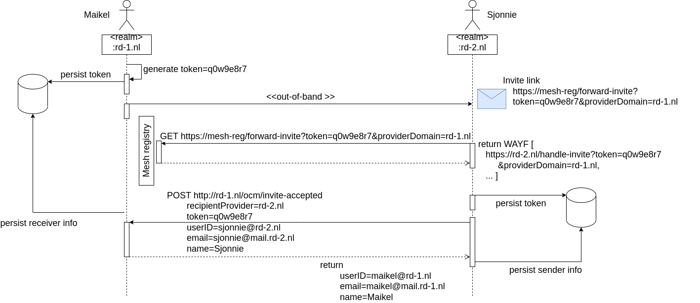

# Invitation app for Federated Sharing

---
### Enhanced federated sharing between Nextcloud instances.
This app gives an enhanced federated sharing user experience by implementing an Invitation Workflow. Through a simple invitation by email to a user of another nextcloud instance the federated user (cloud) IDs are automatically exchanged and saved on each other's systems. From thereon both users can easily start federated sharing with each other via the regular file sharing dialog, because the share dialog will also search for and display invited remote users.  

---
### Invitation Workflow

Fig.2 The invitation workflow as it is implemented.
